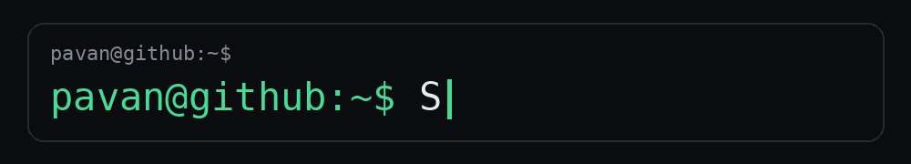

<div align="center">



<br>

### Pavan Kumar

Software Engineering Student · Builder · Problem Solver

<br>

[ C++ ] · [ Python ] · [ JavaScript ] · [ React ] · [ Node.js ] · [ SQL ]

</div>

---

## `$ whoami`

I'm a Software Engineering student who enjoys turning ideas into
working software.

I like going beyond the UI — understanding the backend, databases,
APIs, authentication, application architecture and deployment.

Most of the projects here are things I've built while learning,
experimenting and solving real problems.

---

## ⚡ What I Build

```text
┌──────────────────────────────────────────────────────┐
│                                                      │
│   🌐  Web Applications                               │
│   🤖  AI-powered Applications                        │
│   ⚙️  Backend Systems                                │
│   🗄️  Database-driven Applications                  │
│   🛡️  Cybersecurity Projects                         │
│   🎓  University Projects                             │
│                                                      │
└──────────────────────────────────────────────────────┘